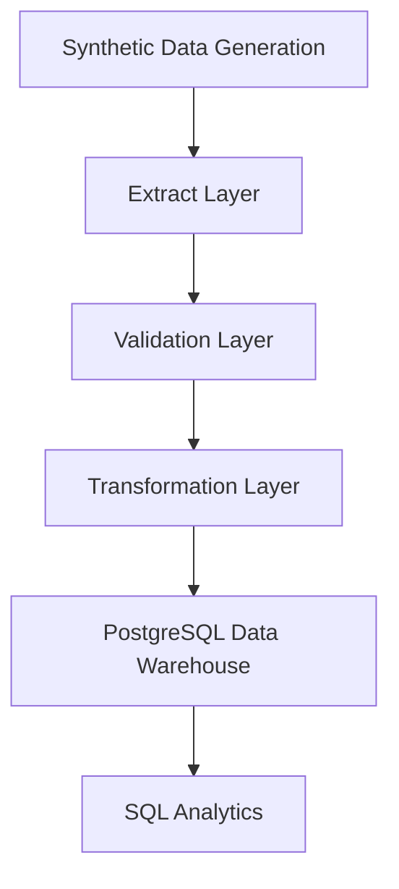

# Healthcare Claims ETL Pipeline

## Overview

This project is an end-to-end healthcare claims ETL pipeline built with Python, PostgreSQL, Pandas, and SQLAlchemy.

For an interoperability-focused clinical platform covering FHIR, HL7 v2, clinical observations, quality controls, and longitudinal analytics, see the sibling [Healthcare Clinical Intelligence Platform](../healthcare_clinical_intelligence/).

The pipeline generates synthetic healthcare claims data, validates data quality, transforms datasets into analytics-ready formats, and loads the results into a PostgreSQL relational database for downstream analysis.

The project demonstrates core data engineering concepts including:

- ETL workflow orchestration
- Relational database modeling
- Data validation and quality checks
- Data transformation pipelines
- PostgreSQL warehouse loading
- SQL analytics and joins
- Modular pipeline architecture

---

# Architecture



---

# Technologies Used

- Python
- Pandas
- PostgreSQL
- SQLAlchemy
- Psycopg2
- SQL
- Pylint
- Conda
- Git

---

# Project Structure

```text
healthcare_claims_etl/
├── data/
│   ├── processed/
│   └── raw/
├── images/
├── logs/
├── sql/
│   ├── analytics_queries.sql
│   └── schema.sql
├── src/
│   ├── extract.py
│   ├── generate_data.py
│   ├── load.py
│   ├── main.py
│   ├── transform.py
│   └── validate.py
├── requirements.txt
└── README.md
```

---

# ETL Workflow

## 1. Synthetic Data Generation

Synthetic healthcare datasets are generated for:

- Patients
- Providers
- Claims

The generated datasets simulate realistic healthcare relational data.

---

## 2. Extraction Layer

The extraction layer loads raw CSV datasets into Pandas DataFrames for processing.

---

## 3. Validation Layer

Validation checks include:

- Required column validation
- Null value detection
- Positive claim amount validation
- Claim status validation
- Foreign key integrity validation

---

## 4. Transformation Layer

Transformations include:

- Datetime parsing
- Claim year/month derivation
- Text normalization
- State standardization
- Analytics-ready enrichment

---

## 5. PostgreSQL Loading

Processed datasets are loaded into PostgreSQL relational tables using SQLAlchemy.

Tables:
- patients
- providers
- claims

---

# Database Schema

The PostgreSQL warehouse contains relational healthcare tables connected through foreign keys.

## claims

| Column | Type |
|---|---|
| claim_id | VARCHAR |
| patient_id | VARCHAR |
| provider_id | VARCHAR |
| diagnosis_code | VARCHAR |
| procedure_code | VARCHAR |
| claim_date | DATE |
| claim_year | INTEGER |
| claim_month | INTEGER |
| claim_amount | NUMERIC |
| insurance_plan | VARCHAR |
| claim_status | VARCHAR |

---

# PostgreSQL Warehouse Validation

The ETL pipeline successfully loads transformed healthcare claims data into PostgreSQL relational tables.

## PostgreSQL Validation and Relational Query Example

The ETL pipeline successfully loads transformed healthcare claims data into PostgreSQL relational tables and supports SQL-based analytical joins.


---

# Example SQL Analytics Queries

## Total Claims by Insurance Plan

```sql
SELECT
    insurance_plan,
    COUNT(*) AS total_claims
FROM claims
GROUP BY insurance_plan
ORDER BY total_claims DESC;
```

## Average Claim Amount by Specialty

```sql
SELECT
    pr.specialty,
    ROUND(AVG(c.claim_amount), 2) AS avg_claim_amount
FROM claims c
JOIN providers pr
    ON c.provider_id = pr.provider_id
GROUP BY pr.specialty
ORDER BY avg_claim_amount DESC;
```

## Claims by State

```sql
SELECT
    p.state,
    COUNT(*) AS total_claims
FROM claims c
JOIN patients p
    ON c.patient_id = p.patient_id
GROUP BY p.state
ORDER BY total_claims DESC;
```

---

# How to Run

## 1. Clone Repository

```bash
git clone git@github.com:andmedina/data-projects.git
```

## 2. Create Conda Environment

```bash
conda create -n data_engineering python=3.11
conda activate data_engineering
```

## 3. Install Dependencies

```bash
conda install pandas sqlalchemy psycopg2
```

## 4. Create PostgreSQL Database

```sql
CREATE DATABASE healthcare_claims_etl;
```

## 5. Run Pipeline

```bash
python src/main.py
```

---

# Future Improvements

- Apache Airflow orchestration
- Docker containerization
- AWS RDS deployment
- S3 raw data storage
- Automated logging framework
- Data quality reporting
- dbt transformations
- CI/CD pipeline integration

---

# Purpose

This project demonstrates production-style healthcare data engineering workflows using modular ETL architecture, relational database modeling, and PostgreSQL warehouse integration.
